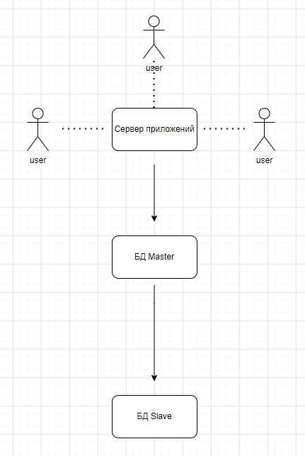
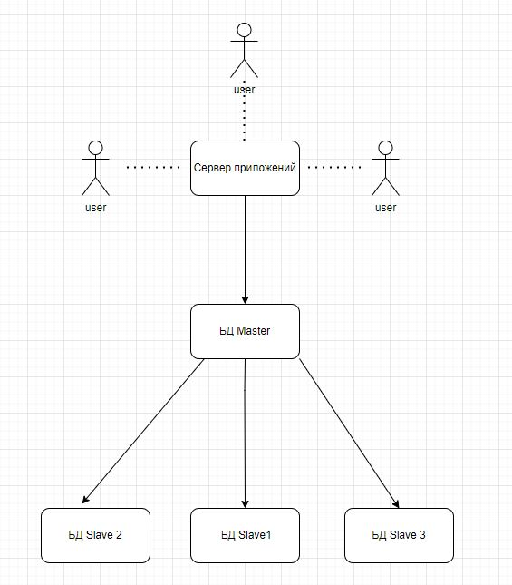
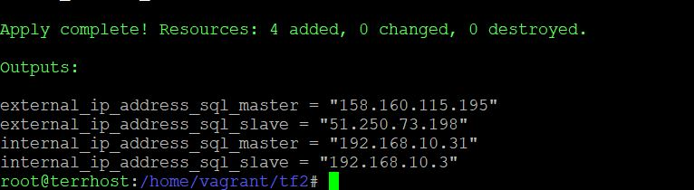
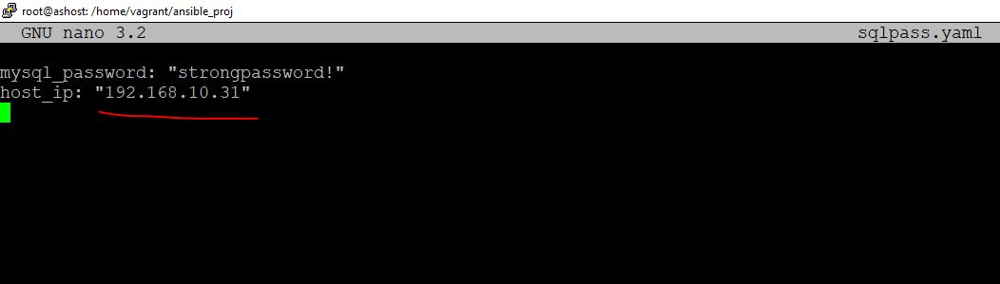
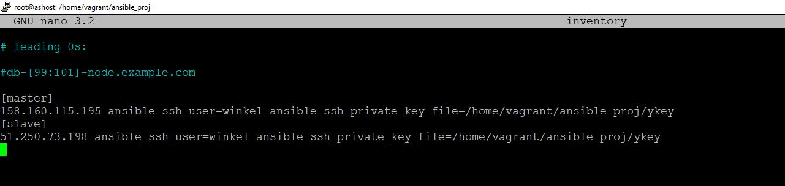

# Домашнее задание к занятию «Репликация и масштабирование. Часть 2», Лебедев А. И., fops-10


### Задание 1

Опишите основные преимущества использования масштабирования методами:

- активный master-сервер и пассивный репликационный slave-сервер; 
- master-сервер и несколько slave-серверов;
- активный сервер со специальным механизмом репликации — distributed replicated block device (DRBD);
- SAN-кластер.

*Дайте ответ в свободной форме.*  

### Ответ:  

- **Активный master и пассивный slave:** Этот метод обеспечивает резервное копирование и высокую доступность. Когда основной сервер (master) недоступен, пассивный сервер (slave) может взять на себя работу. Такой метод подходит для приложений, где недопустимы простои.

- **Множество slave-серверов:** Этот метод позволяет распределить нагрузку на чтение и обеспечивает отказоустойчивость. Если один из серверов выходит из строя, другие могут продолжить работу.

- **DRBD:** Этот механизм репликации обеспечивает высокую доступность и синхронность данных. В случае сбоя основного сервера, реплика может мгновенно взять на себя обработку запросов.

- **SAN-кластер:** Такой кластер предоставляет высокую доступность и централизованное управление. Все серверы могут иметь доступ к общему хранилищу, что облегчает обмен данными.

---

### Задание 2


Разработайте план для выполнения горизонтального и вертикального шаринга базы данных. База данных состоит из трёх таблиц: 

- пользователи, 
- книги, 
- магазины (столбцы произвольно). 

Опишите принципы построения системы и их разграничение или разбивку между базами данных.

*Пришлите блоксхему, где и что будет располагаться. Опишите, в каких режимах будут работать сервера.*   

### Ответ:  

- Данное задание я буду выполнять путем приведения примеров MySQL конфигов и небольшого пояснения.

Вот пример вертикального шаринга (Scaling Up, когда каждый столбец, по сути, является отдельной физической таблицей):

```

CREATE DATABASE vertical_db;


CREATE TABLE user_name (
    user_id INT AUTO_INCREMENT PRIMARY KEY,
    name VARCHAR(255)
);


CREATE TABLE user_contact (
    user_id INT AUTO_INCREMENT PRIMARY KEY,
    email VARCHAR(255),
    FOREIGN KEY (user_id) REFERENCES users_info(user_id)
);

CREATE TABLE book_title (
    book_id INT AUTO_INCREMENT PRIMARY KEY,
    title VARCHAR(255),
    author VARCHAR(255),
);

CREATE TABLE book_author (
    book_id INT AUTO_INCREMENT PRIMARY KEY,
    title VARCHAR(255),
    author VARCHAR(255),
);

CREATE TABLE stores_central (
    store_id INT AUTO_INCREMENT PRIMARY KEY,
    store_name VARCHAR(255),
    address VARCHAR(255)
);

CREATE TABLE stores_suburban (
    store_id INT AUTO_INCREMENT PRIMARY KEY,
    store_name VARCHAR(255),
    address VARCHAR(255)
);

```

- Если с вертикальным масштабированием пример конфига базы можно привести относительно легко, т. к. модель scaling up (вертикальное масштабирование) как раз и предполагает масштабирование на одном мощном устройстве, то с горизонтальным (в виде MySQL конфига), это будет выглядеть, примерно, вот так:

```

CREATE DATABASE horizontal_db;

CREATE TABLE user_range_A (
    user_id INT AUTO_INCREMENT PRIMARY KEY,
    name VARCHAR(255),
    email VARCHAR(255)
);

CREATE TABLE user_range_B (
    user_id INT AUTO_INCREMENT PRIMARY KEY,
    name VARCHAR(255),
    email VARCHAR(255)
);

CREATE TABLE book_range_A (
    book_id INT AUTO_INCREMENT PRIMARY KEY,
    user_id INT, 
    book_title VARCHAR(255),
    book_author VARCHAR(255),
    FOREIGN KEY (user_id) REFERENCES users_range_A(user_id)  
);

CREATE TABLE book_range_B (
    book_id INT AUTO_INCREMENT PRIMARY KEY,
    user_id INT, 
    book_title VARCHAR(255),
    book_author VARCHAR(255),
    FOREIGN KEY (user_id) REFERENCES users_range_B(user_id)  
);

CREATE TABLE stores_central_range_A (
    store_id INT AUTO_INCREMENT PRIMARY KEY,
    store_name VARCHAR(255),
    store_address VARCHAR(255)
);

CREATE TABLE stores_central_range_B (
    store_id INT AUTO_INCREMENT PRIMARY KEY,
    store_name VARCHAR(255),
    store_address VARCHAR(255)
);

CREATE TABLE stores_suburban_range_A (
    store_id INT AUTO_INCREMENT PRIMARY KEY,
    store_name VARCHAR(255),
    store_address VARCHAR(255)
);

CREATE TABLE stores_suburban_range_B (
    store_id INT AUTO_INCREMENT PRIMARY KEY,
    store_name VARCHAR(255),
    store_address VARCHAR(255)
);
```

Но, согласитесь, делать все это в одной базе и на одной машине не имеет вообще никакого смысла, т.к. логика горизонтального масштабирования - "размазывание" данных по нескольким серверам с помощью репликации и использования slave-серверов на чтение.   

---  

  
### Задание 3*

Выполните настройку выбранных методов шардинга из задания 2.

*Пришлите конфиг Docker и SQL скрипт с командами для базы данных*.  

### Решение:  

- Вероятно, это будет частичное решение данной задачи. Давайте посмотрим на схематические примеры вертикального и горизонтального масштабирования на примере master-slave еонфигурации:

**Scale up**  

   

**Scale Out**  

   

- Я попытаюсь реализовать вертикальное масштабирование путем загрузки конфигурации выше на master-slave кластер.

- Для построения master-slave кластера я существенно автоматизировал выполнение предыдущего домашнего задания (оно находится <code>[тут](https://github.com/luckynuckywinkel/netology_sdb12_hw06_SQL_rep-scale_vol1 "SQL-rep-scale-vol1")</code>) и вот, что было сделано:

- Используются, также, terraform + ansible, инфраструктура разворачивается в yandex-cloud. Для автоматизации процесса, был создан файл с переменными, куда tf и ansible заворачивают значения после исполнения скрипта. Самым сложным моментом было вытащить значения binlog file и binlog position.
В общем, все файлы я прикрепляю к этому ДЗ и, надеюсь, вы их посомтрите. Мне очень важно ваше мнение, т.к. я реально провел над этим всем почти три дня. Да, я знаю, что там нужно еще доработать, но у меня горят остальные работы и я могу закопаться на неделю в этом, т.к. сей процесс невероятно интересен.

- Собственно, погнали по шагам. Разворачиваем две виртушки на YC (terraform/main.tf, infrastructure.tf, outputs.tf, variables.tf, meta.yaml). Здесь я обращу ваше внимание, что terraform host и ansible host - у меня это две разные виртуалки.

   

- Посмотрим, что записалось в файл с переменными (sqlpass.yaml) и в inventory на ansible-host:

  

 
